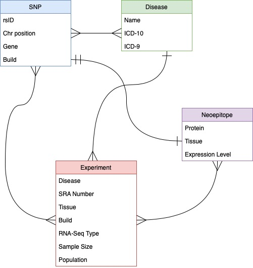
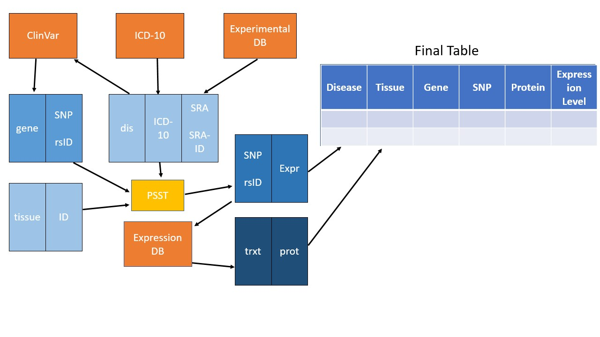
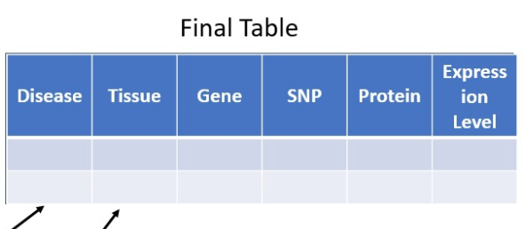

# Chronic-Disease-NeoEpitopes

# Neoepitope Identifier!

There is no spoon

Paper citation/DOI here

# Introduction:

## Entity Relationship Diagram

## Software design diagram:

Detailed information to make the final table

## What is the problem that needs to be solved?

Finding a list of SNPs present in RNAseq data is currently feasible, but the more actionable information is the resultant proteins from the SNP-containing transcripts.

## How will we solve the problem?

We will solve the problem by combining and updating the already-available tools named PSST and SC3, and incorporating SNP-transcript translation using Ensembl. We will have multiple tables that when combined and converted to an SQL database, will be queryable but also able to be added to, should a researcher want to contribute to it. 

## What is 'NI!'?
Neoepitope Identifier! is the SQL database that contains disease specific neoepitopes.  

# Instructions for Use:

## Use 1: Searching the existing database for information

If you want to see the SNP/Protein profile of a certain disease, here's an example query:

`SELECT * FROM combined_table WHERE disease='Arthritis'`

## Use 2: Running your own experiment and contributing to the database

You will need: BioprojectID for your disease of interest, a list of SNPs, and the dependencies needed to run PSST.
You will run SC3.sh (which contains PSST.sh) using the BioprojectID, which will output a list of SNPs.

# Results:

# Conclusions and next steps:
Combining the available databases into one database with a simple neoepitope output allows for researchers and clinicians to easily find new protein targets. These targets can be used for researching disease mechanisms and drug targets. 

## Future Thoughts
Web hosting of the SQL database.

Adding/Linking more protein data to the database:
 - Protein structural information from PDB/RSCB
 - Post-translational modifications from UniProt
 - Organelle localization from fluorescence microscopy database

